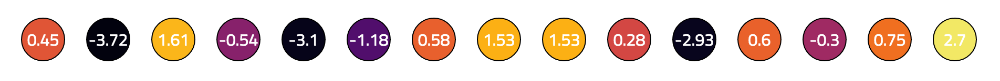

# An Extremely Brief Introduction to Neural Networks
A neural network is a statistical model for approximating complex functions, and they are especially well suited for computer processing. Neural networks are able to solve problems such as image and speech recognition, where the input is large and difficult to quantify with hard and fast rules. As their name suggests, neural networks are structured _somewhat_ similarly to the brain, but this is only a rough analogy. A much better understanding comes from actually seeing one in action, which is the goal of this demonstration.

# Meet a JavaScript Neural Network


This is an in-browser, JavaScript neural network that identifies handwritten numbers with >95% accuracy. It is inspired by its python cousin [here](https://github.com/makeyourownneuralnetwork/makeyourownneuralnetwork) (thanks to Tariq Rashid for his excellent book). Everything the network needs to function, including training data, is packaged in the JavaScript - no back end necessary.

```javascript
NeuralNetwork.prototype.query = function(inputs) {
  this.inputs = Numeric.transpose([inputs]);

  this.hiddenInputs = Numeric.dot(this.wih, this.inputs);
  this.hiddenOutputs = this.hiddenInputs.map( row =>
    row.map(x => MyMath.sigmoid(x))
  );

  this.finalInputs = Numeric.dot(this.who, this.hiddenOutputs);
  this.finalOutputs = this.finalInputs.map( row =>
    row.map(x => MyMath.sigmoid(x))
  );

  return this.finalOutputs;
};
```

Upon loading the page, a new, untrained neural network is instantiated. Because there is an element of randomness in creating a network, each one is unique and the results between them may very ever so slightly. The network immediately sets to the task of training itself on 500 sample images. Once complete, you may query the network with any of ten new images that the network has not yet encountered. Pick a number and watch as the network walks you through the steps it takes in processing it. Have fun!
